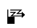
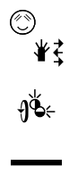
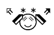
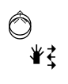

# SignWriting Translation

This project trains and serves models to translate SignWriting into spoken language text and vice versa.

Ideally, we would like to use [Bergamot](https://github.com/mozilla/firefox-translations-training),
but we could not get it to work.

## Usage

```bash
pip install git+https://github.com/sign-language-processing/signwriting-translation
```

To translate:

```bash
signwriting_to_text --spoken-language="en" --signed-language="ase" --input="M525x535S2e748483x510S10011501x466S2e704510x500S10019476x475"
text_to_signwriting --spoken-language="en" --signed-language="ase" --input="Sign Language"
```

## Motivating Examples

The use of machine translation from spoken language to SignWriting can be beneficial in many ways.
Here are a few examples where we compare the output of the machine translation to the output of a
[gloss-based dictionary translation](https://github.com/sign-language-processing/spoken-to-signed-translation).

#### Robustness to minor inconsequential changes

Here is an example where a minor, inconsequential, and possibly even **wrong** modification to the spoken language
yields the same correct translation in SignWriting (the sign for the city of zurich)
but the dictionary yields two different ones.

| Text                                                         | Machine Translation                                                          | Dictionary Translation                          |
|--------------------------------------------------------------|------------------------------------------------------------------------------|-------------------------------------------------|
| [Zürich](https://sign.mt/?spl=de&sil=sgg&text=Z%C3%BCrich)   |    | The sign for Zurich (correct)                   |
| [Zurich](https://sign.mt/?spl=de&sil=sgg&text=Zurich)        |    | Spelling the city name without umlaut (strange) | 
| [Züerich](https://sign.mt/?spl=de&sil=sgg&text=Z%C3%BCerich) |  | Spelling the city name (strange)                |

-----

#### Adaptivity to minor important changes

Here is an example where a minor, important modification to the spoken language (exclamation/question) yields different,
correct translations in SignWriting (reflecting the emotion) but the dictionary yields the same one.
Changing to question mark, the face correctly become questioning (even though the SignWriting is not perfect).

| Text                                                                  | Machine Translation                                                                    | Dictionary Translation                            |
|-----------------------------------------------------------------------|----------------------------------------------------------------------------------------|---------------------------------------------------|
| [Hello world.](https://sign.mt/?spl=en&sil=ase&text=Hello%20world.)   |       | The sign for Hello followed by the sign for World |
| [Hello world!](https://sign.mt/?spl=en&sil=ase&text=Hello%20world!)   |  | The sign for Hello followed by the sign for World |
| [Hello world?](https://sign.mt/?spl=en&sil=ase&text=Hello%20world%3F) |     | The sign for Hello followed by the sign for World |

## Data

We use the SignBank+ Dataset from [signbank-plus](https://github.com/sign-language-processing/signbank-plus).

After finding a large mismatch in distribution between the `validation` and `test` sets,
we decided to use the `test` set as the `validation` set, without training multiple models.
This is a *bad* decision if we were to train and compare multiple models, or want to improve the model in the future.
To change this, change the `sockeye.train` command in the `train_sockeye_model.sh` script.

## Steps

```bash
# 0. Setup the environment.
conda create --name sockeye python=3.11 -y
conda activate sockeye

cd signwriting_translation

MODEL_DIR=/shares/iict-sp2.ebling.cl.uzh/amoryo/checkpoints/signwriting-translation
DATA_DIR=/home/amoryo/sign-language/signwriting-translation/parallel
DIRECTION="spoken-to-signed"

# 1. Download and tokenize the signbank-plus dataset 
sbatch prepare_data.sh

# 2. Train a spoken-to-signed translation model
# (Train without factors)
sbatch train_sockeye_model.sh \
 --data_dir="$DATA_DIR/$DIRECTION" \
 --model_dir="$MODEL_DIR/$DIRECTION/no-factors-gpt" \
 --optimized_metric="signwriting-similarity" \
  --partition lowprio
# (Train with factors)
sbatch train_sockeye_model.sh \
  --data_dir="$DATA_DIR/$DIRECTION" \
  --model_dir="$MODEL_DIR/$DIRECTION/target-factors-gpt" \
  --optimized_metric="signwriting-similarity" \
  --use_target_factors=true \
  --partition lowprio
# (Fine tune model on cleaned data)
sbatch train_sockeye_model.sh \
  --data_dir="$DATA_DIR-clean/$DIRECTION" \
  --model_dir="$MODEL_DIR/$DIRECTION/target-factors-gpt-tuned" \
  --base_model_dir="$MODEL_DIR/$DIRECTION/target-factors-gpt" \
  --optimized_metric="signwriting-similarity" \
  --use_target_factors=true \
  --partition lowprio
  
# 2.1 (Optional) See the validation metrics
cat "$MODEL_DIR/$DIRECTION/no-factors/model/metrics" | grep "signwriting-similarity"
cat "$MODEL_DIR/$DIRECTION/target-factors/model/metrics" | grep "signwriting-similarity"

# 3. Test it yourself
python -m signwriting_translation.bin \
  --model="$MODEL_DIR/$DIRECTION/target-factors-gpt/model" \
  --spoken-language="en" \
  --signed-language="ase" \
  --input="My name is John."
```

## Upload to HuggingFace

```bash
# Copy the model files to a new directory
SE_MODEL_PATH="$MODEL_DIR/$DIRECTION/target-factors-gpt-tuned"
HF_MODEL_PATH="$MODEL_DIR/$DIRECTION/huggingface/target-factors-gpt-tuned"

rm -r  "$HF_MODEL_PATH"
mkdir -p "$HF_MODEL_PATH"
cp "$SE_MODEL_PATH/model/params.best" "$HF_MODEL_PATH/params.best"
cp "$SE_MODEL_PATH/model/version" "$HF_MODEL_PATH/version"
cp "$SE_MODEL_PATH/model/metrics" "$HF_MODEL_PATH/metrics"
cp "$SE_MODEL_PATH/model/config" "$HF_MODEL_PATH/config"
cp "$SE_MODEL_PATH/model/args.yaml" "$HF_MODEL_PATH/args.yaml"
cp "$SE_MODEL_PATH/model/vocab."* "$HF_MODEL_PATH"
# if tokenizer exists
! [ -f "tokenizer.json" ] && cp tokenizer.json "$HF_MODEL_PATH/tokenizer.json"

# Upload to HuggingFace
huggingface-cli login
huggingface-cli upload sign/sockeye-text-to-factored-signwriting "$HF_MODEL_PATH" .
```
